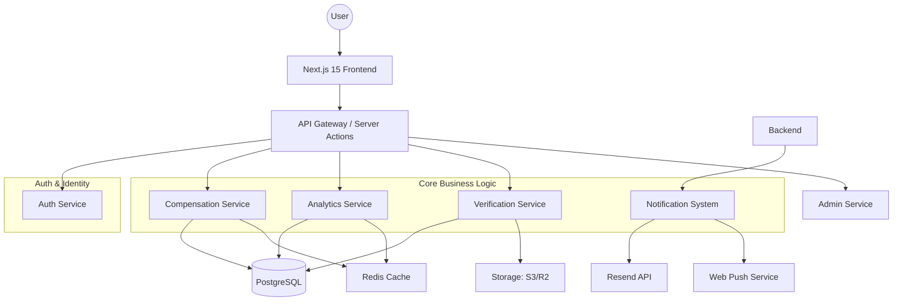
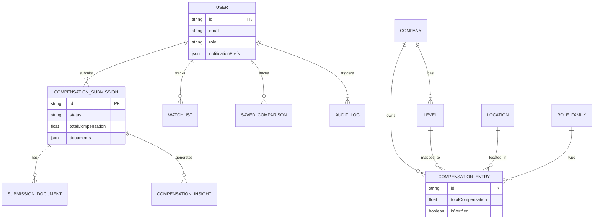
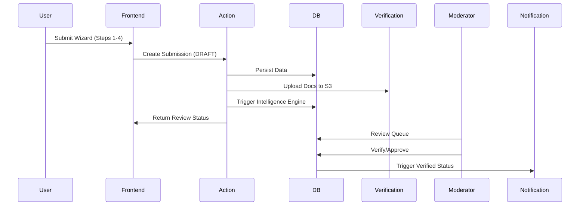
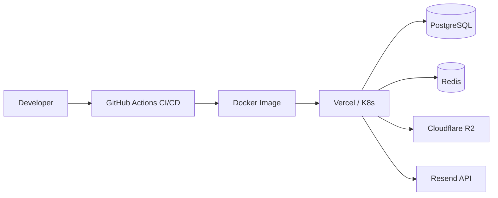

# 📈 Compensation Intelligence System

![Project Logo Placeholder]

**"The Bloomberg for Compensation: Benchmarking, Analytics & Offer Optimization"**

> "Levels are the language of professional compensation."

---

## 🛡️ Status & Badges

---

## 1. Product Overview

The compensation landscape is broken. Data is fragmented, job titles are misleading, and salary bands are guarded behind corporate gates. The **Compensation Intelligence System** disrupts this by democratizing high-fidelity, normalized compensation data.

### 🎯 The "Staff Engineer" Perspective
We transform raw, user-contributed salary submissions into actionable market intelligence. We prioritize **Level Normalization** over raw job titles, ensuring that comparisons are based on standardized career ranks (1–10) rather than misleading naming conventions.

### Core Philosophy: "Levels Matter More Than Titles"
A "Senior Engineer" at a mid-market startup is not equivalent to a "Senior Engineer" at Google. Our system maps internal titles to a universal **Normalized Rank**, allowing for true Apple-to-Apple comparisons across the industry.

---

## 2. Feature Matrix

| Module | Purpose | Core Intelligence Metric |
| :--- | :--- | :--- |
| **Salary Explorer** | Global record search | Median, Percentiles (P10-P95) |
| **Companies** | Firm-specific benchmarking | Industry growth, Pay competitiveness |
| **Analytics** | Macro trend modeling | Histograms, Distribution Skew |
| **Comp Compare** | Side-by-side analysis | Package parity (TC breakdown) |
| **Locations** | Geo-intelligence | Cost of Living Index (COLI) adjustment |
| **Levels** | Career Ladder benchmarking | Level Rank (1-10) Equivalency |
| **Watchlist** | Real-time monitoring | Automated Market Alerts |
| **Salary Submission** | Data Contribution | Multi-step Wizard + Intelligence Engine |
| **Verification** | Trust orchestration | OCR + Admin Moderator Workflow |
| **Admin Dashboard** | Governance layer | Normalization Tools, Audit Logs |

---

## 3. High-Level Architecture (HLD)

The platform is designed as a modular, scalable SaaS application leveraging the Next.js App Router for server-side performance and React Query for client-side reactivity.

---

## 4. Microservice Architecture

### 1. User Service
*   **Purpose:** Identity management, RBAC, Profile Persistence.
*   **Input:** OAuth Credentials.
*   **Output:** JWT Sessions, Role-based ACLs.

### 2. Compensation Service
*   **Purpose:** Salary submission, TC calculation, normalization.
*   **Logic:** Executes fuzzy matching for company name canonicalization (e.g., "Google LLC" -> "Google").
*   **Dependencies:** Zod, Normalization Library.

### 3. Analytics Service
*   **Purpose:** Macro-level market intelligence.
*   **Output:** Percentiles, Distributions, Trends.
*   **Strategy:** Compute heavy aggregations offline/background; cache results in Redis.

### 4. Verification Service
*   **Purpose:** Trust orchestration.
*   **Logic:** Admin Review Queue + Submission Document management.
*   **Tables:** `SubmissionDocument`, `VerificationReview`.

---

## 5. Database Schema (ERD)

---

## 6. Compensation Intelligence Engine

### The Formula
`TC = Base_Salary + Annual_Bonus + Signing_Bonus + Performance_Bonus + (Total_Stock_Grant / 4) + Other`

### The Normalization Pipeline
1.  **Ingestion:** Raw user data input.
2.  **Canonicalization:** Map Company Name -> Normalized Company (e.g., "Google LLC" -> "Google").
3.  **Level Mapping:** Map Internal Level -> Level Rank (1-10).
4.  **Percentile Positioning:** Database lookup for `Count(TC) WHERE Rank = 4 AND Company = Google`.
5.  **Insight Generation:** Compare against cohort median; generate comparative string.

---

## 7. Workflows

### Salary Submission Sequence

---

## 8. API Design

| Endpoint | Method | Purpose | Authorization |
| :--- | :--- | :--- | :--- |
| `/api/auth/*` | POST | NextAuth Handlers | Public |
| `/api/submissions`| POST | Salary Submission | User |
| `/api/compare` | POST | Comparison Engine | Public |
| `/api/admin/reviews`| GET | Admin Queue | Admin |
| `/api/watchlist` | POST | Watcher Engine | User |

---

## 9. Security Architecture

1.  **RBAC:** Middleware-level enforcement of `ADMIN`/`MODERATOR`/`USER` roles.
2.  **JWT Sessions:** Secure HTTP-only cookie sessions via Auth.js.
3.  **Data Validation:** Zod schemas applied at API routes, Server Actions, and UI forms.
4.  **File Validation:** UploadThing enforces file-type/size limits.
5.  **Audit Logs:** Every change in the Admin tool is persisted.

---

## 10. Scalability Strategy

To reach **10M+ records** and **100k concurrent users**:
*   **Database:** Partitioning `compensation_entries` by `company_id`.
*   **Caching:** Redis for percentile data and company metadata.
*   **Async Processing:** BullMQ + Redis for background market monitoring.
*   **CDN:** Edge deployment for global access.

---

## 11. Deployment

---

## 12. Roadmap

- [x] **Phase 1:** Salary Contributions (Wizard + Verification Engine)
- [x] **Phase 2:** Authentication (Auth.js + RBAC + Persistence)
- [x] **Phase 3:** Administrative Control Center (Review Queue + Normalization)
- [x] **Phase 4:** Market Intelligence Alerts (Watcher Engine + Notifications)
- [ ] **Phase 5:** AI Compensation Advisor (LLM Integration)
- [ ] **Phase 6:** Negotiation Assistant (Offers + Insights)

---
*Generated by Principal Software Architect & Technical Writer Agent*
